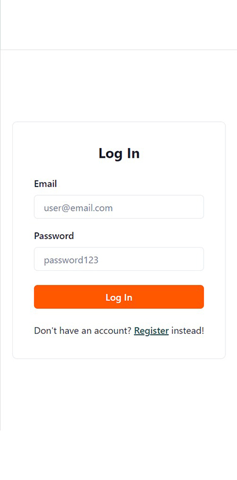
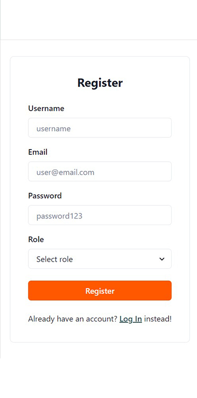

## Team Code Commandos Official Hackathon Project

### Sustainable development🌲 Through Technology 💻

Hunger Free is a website dedicated to fighting hunger by connecting contributors with surplus food to volunteers who distribute it to those in need. Our platform aims to organize the process of collecting surplus food from contributors and distributing it to needy people through volunteers. ♻✅

Here is a preview of our WEB-APP for our amazing platform!
## Screenshots

- **Homepage**
  
.jpg) 

- **Login Page**

 

- **Message Page**
  

## Installation Guide

1. Clone the repository to your local machine.
2. Navigate to the project directory in your terminal.
5. In the terminal, run `npm install` to install frontend dependencies.
6. Once dependencies are installed, run `npm start` frontend directories to start the development servers.

### Our Team -
- Balaji D
- Deepan B
- Karthikeyan G
- Prem kumar Ruban T
- Monesh U

### Our Final Deployments -

- Website: [https://hungerfree.vercel.app/]
- WebApp: [https://hungerfree-app.vercel.app/]
- Repo link for WebApp: [https://github.com/codewithbalaji/hunger-free-web]

